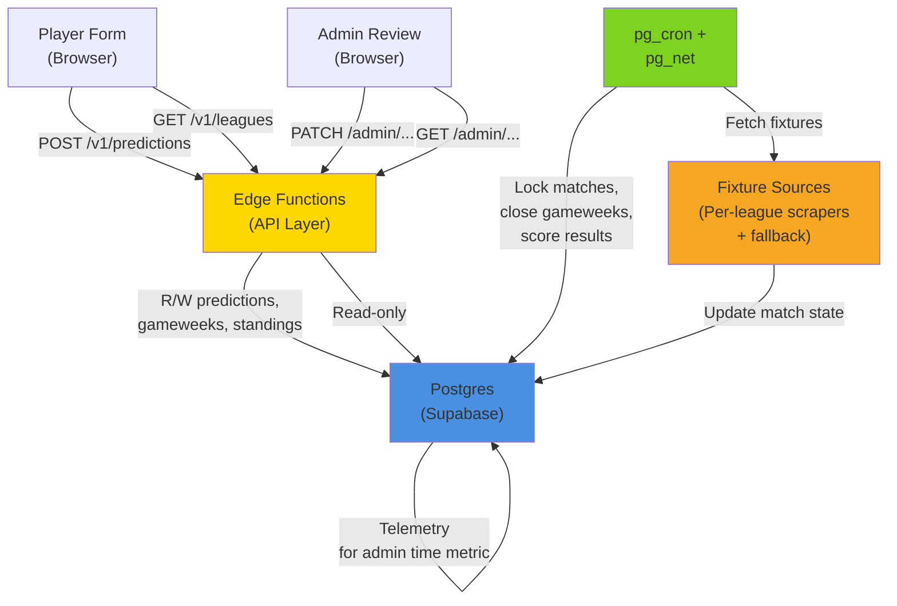

# Jeu des Pronos

A football prediction game automation system that consolidates and automates a 13-year-old spreadsheet-based prediction game across three European leagues (Ligue 1, Premier League, Bundesliga). This system replaces manual scoring, duplicate-player detection, and fixture management that previously ran across nine spreadsheets and per-league automation scripts.

## Overview

Players submit score predictions for matches in their league of choice before kickoff. The system locks submissions at match start (server-side, never trusting the client) and, once results are recorded, computes scores (5 points for exact prediction, 3 for correct result, 2 for correct goal differential, 0 otherwise) and ranks players by points. It detects near-duplicate player pseudos (typos like "Lio_92" vs "Lio92") for manual review, and provides an admin interface for manual overrides. See "Current Status" below for what's actually wired versus still pending.

The game runs weekly during the football season across ~10-20 players per league. Success is measured by reducing weekly admin time from ~1 hour to under 5 minutes.

## Tech Stack

- **Backend**: Supabase (Postgres + Edge Functions)
- **Scheduling**: pg_cron + pg_net (Postgres extensions, run inside the database)
- **Frontend**: Static HTML form + admin review view (Cloudflare Pages)
- **Fixtures/Results**: Per-league scrapers with recorded-fixture fallback (under `fixture-ingestion` slice)
- **Testing**: TypeScript + Vitest + Testcontainers (real Postgres 16)
- **API contract**: OpenAPI 3.1, enforced both sides with Prism (consumer) and Schemathesis (provider)

## Getting Started

### Prerequisites

- Node.js ≥ 22.18
- Docker (required for Testcontainers)
- Python 3 (for contract test harness)

### Setup and Test

```bash
# Install dependencies
npm install

# Set up the contract test harness (one-time, creates a Python venv)
npm run setup:contract

# Run the full test suite (all 118 tests)
npm test

# Run by category
npm run test:unit      # pure-function domain tests (fast)
npm run test:db        # real Postgres: constraints, RLS
npm run test:contract  # OpenAPI contract both sides (Prism + Schemathesis)
npm run test:e2e       # two critical journeys
```

The test suite is the primary documentation of system behaviour; every acceptance criterion and NFR is asserted as a test.

## Architecture



**Key design decisions:**
- Scheduling runs *inside* Postgres (pg_cron) at minute-level granularity, not on a separate sleeping container — eliminates scheduling precision gaps that plagued earlier designs.
- All writes go through Edge Functions, which are the single point of kickoff-time validation and telemetry emission.
- RLS (row-level security) prevents direct PostgREST access by players, blocking any bypass of the API layer's lock check.
- No accounts: players are identified by a free-text pseudo string, with browser-side localStorage for convenient re-entry (AC-10).

See [`docs/architecture.md`](docs/architecture.md) for the full C4 context diagram and design rationale.

## API Surface

The system exposes 8 operations under `/v1`:

**Public (unauthenticated):**
- `GET /v1/leagues` — List all configured leagues (Ligue 1, Premier League, Bundesliga, plus any fourth configured via `leagues.config`)
- `GET /v1/leagues/{id}/current` — Get the league's open gameweek and its matches; returns lock state (`starts_at <= now()`) computed at request time
- `POST /v1/predictions` — Submit or overwrite a player's prediction for one match; rejects if the match has kicked off
- `GET /v1/leagues/{id}/gameweeks/{id}/standings` — Paginated classement (rankings) for one gameweek
- `GET /v1/leagues/{id}/seasons/{id}/standings/overall` — Season-long standings

**Admin (requires Supabase Auth bearer JWT):**
- `GET /v1/admin/duplicate-flags` — List near-duplicate pseudos detected and flagged for review; filter by status (pending/reviewed/dismissed)
- `PATCH /v1/admin/duplicate-flags/{id}` — Mark a flag reviewed or dismissed (never merges or blocks players)
- `POST /v1/admin/gameweeks/{id}/override` — Manually open, close, or re-score a gameweek when automation fails; includes duration estimate for the "weekly admin time" metric

Full specification in [`pdlc/jeu-des-pronos/contracts/openapi.yaml`](pdlc/jeu-des-pronos/contracts/openapi.yaml).

## Current Status

**What's shipped (118/118 tests passing, verify + polish gates complete):**
- Full database schema with migrations using expand-only discipline (no schema rollbacks possible on Supabase Free, so migrations must be one-way-safe)
- All 8 API endpoints working with kickoff-time lock enforcement, upsert semantics, rate limiting, idempotency keys
- Scoring engine (5/3/2/0 points, double-gameweek summation, blank-gameweek handling)
- Duplicate-pseudo detection (string-distance algorithm) and admin review queue
- Telemetry event pipeline for 8 event types (all land in `telemetry_events` table)
- Per-league independence: gameweek transitions and scoring run per-league without interference
- Configurable 4th league via `leagues.config` (database, no code changes)
- RLS, rate limiting (10 req/min per IP), and other security controls
- Fixture/results ingestion: hourly GitHub Actions job (`.github/workflows/ingest-fixtures.yml`) syncs each of the 5 leagues' currently-open gameweek from live league data into `games` via `POST /v1/ingest/fixtures`
- `match_locked` / `gameweek_opened` / `gameweek_closed` are now emitted automatically: `POST /v1/internal/tick` (`src/api/tick.ts`) is the pg_cron/pg_net entry point into the previously-unwired `gameweekTransition.tick()`, scheduled every minute by `db/migrations/20260825090000_schedule_gameweek_transition_tick.sql`

**What's built but not yet end-to-end wired:**

One of eight telemetry event types has correct domain logic and unit tests, but no scheduled trigger in production yet:
- `duplicate_flagged` — detection logic is tested, weekly cron job pending

The other seven event types (`match_locked`, `prediction_submitted`, `prediction_rejected_late`, `gameweek_opened`, `gameweek_closed`, `scoring_run_completed`, `admin_manual_intervention`) are wired and firing.

**One manual deploy step:** the tick job's bearer token can't be committed to git — before it can call `POST /v1/internal/tick` successfully, run once from the Supabase SQL editor (using the same value already held as the `INGEST_TOKEN` secret): `select vault.create_secret('<the INGEST_TOKEN value>', 'tick_token');`. See the migration file for details.

**Out of scope (explicitly excluded):**
- Mini-leagues, native mobile app, AI prediction features, monetization, website migration to Wix
- Account system: no passwords, no login, no mandatory email (email is optional for receipts only)

## Success Metric

Weekly admin time spent on manual scoring, duplicate-player review, and fixture management. Target: under 5 minutes per week. Baseline to be measured in production before the new season, so that pre-automation and post-automation numbers can be compared.

## Development

### Running Locally

All tests run against a real Postgres 16 instance (via Testcontainers), so Docker must be available. Tests are deterministic and use UUIDs matching the OpenAPI examples (`contracts/openapi.yaml`).

### Project Layout

- `src/` — Production code (TypeScript, Node.js, runs in Supabase Edge Functions)
- `db/migrations/` — Schema migrations (SQL, applied before tests run)
- `pdlc/jeu-des-pronos/contracts/` — API contract (OpenAPI 3.1) and database DDL
- `tests/` — Full test suite (unit, integration, contract, e2e)
- `pdlc/` — Gate evidence and decision records (frozen; for reference only)

### Key Decisions

See [`pdlc/jeu-des-pronos/adr/`](pdlc/jeu-des-pronos/adr/) for architectural decision records:
- ADR-0001: Supabase Postgres + Edge Functions + pg_cron (vs Cloudflare Workers, Render, Airtable)
- ADR-0002: Pseudo string as identity; no server-side device tracking
- ADR-0003: Mandatory expand-only schema migrations as the only rollback mechanism (Supabase Free has no PITR)

## License

Unlicensed (private hobby project).
